# Loney - A Loan Application UI

Loney is a modern and user-friendly loan application UI built with Flutter, designed to provide a seamless experience across multiple platforms.

## Features

* **Cross-Platform Support:** Runs smoothly on Android, Linux, and Windows.
* **Clean and Intuitive UI:** A user-friendly interface for easy loan applications.
* **GitHub Actions CI/CD:** Automated build and release process.
* **Responsive Design:** Adapts to different screen sizes and devices.
* **[Add more features specific to your UI here]**

## Screenshots

<p>
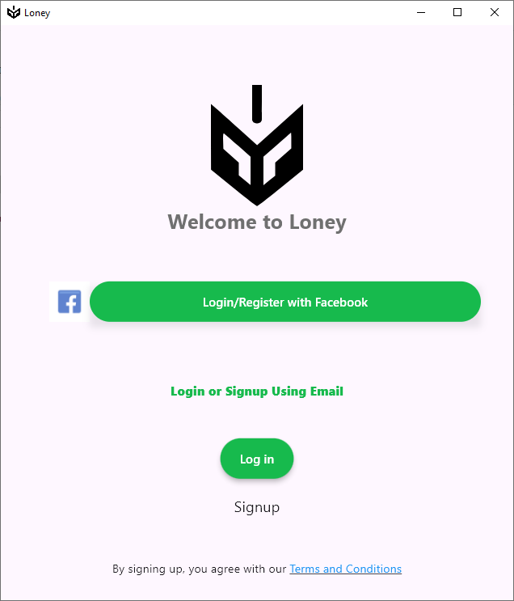
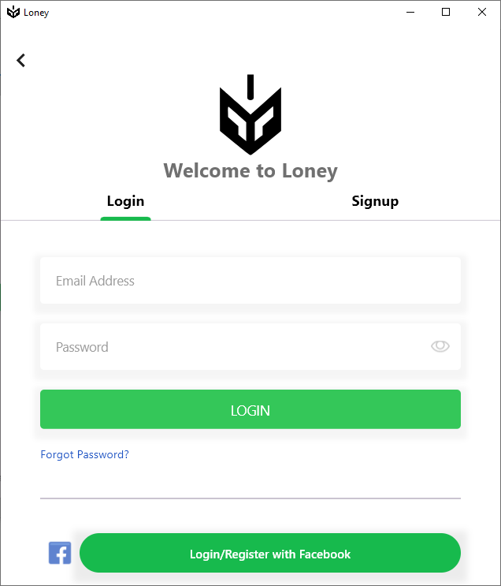
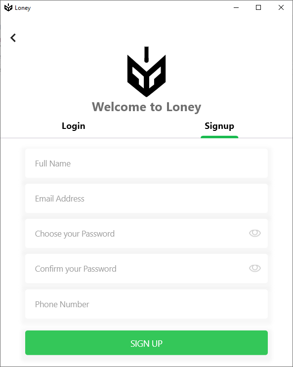
</p>
<p>
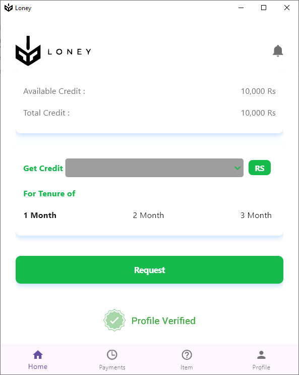
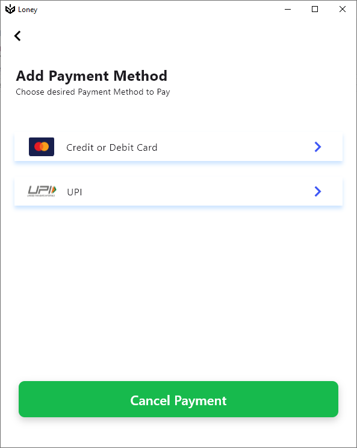
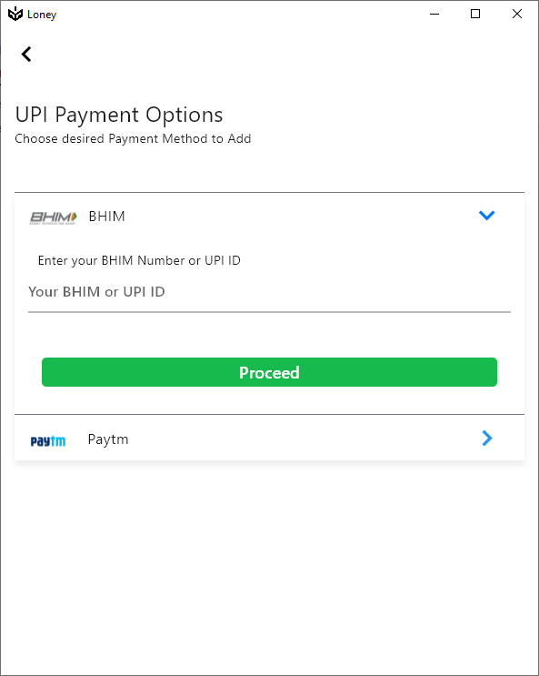
</p>
<p>
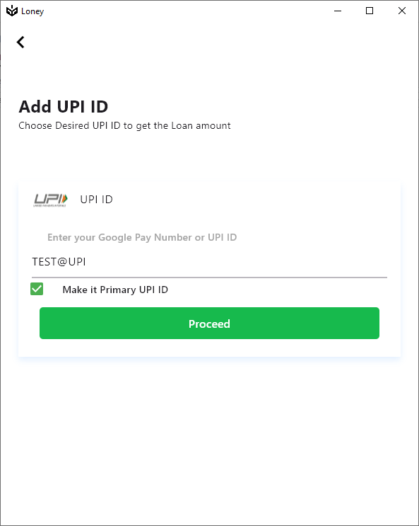
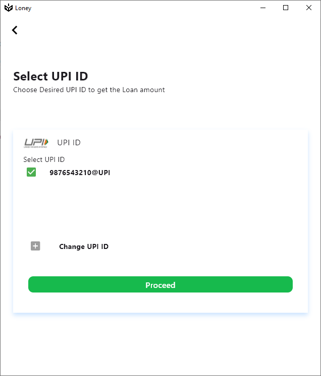
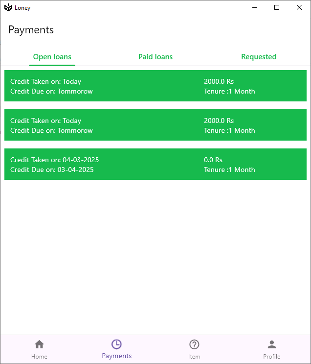
</p>
<p>
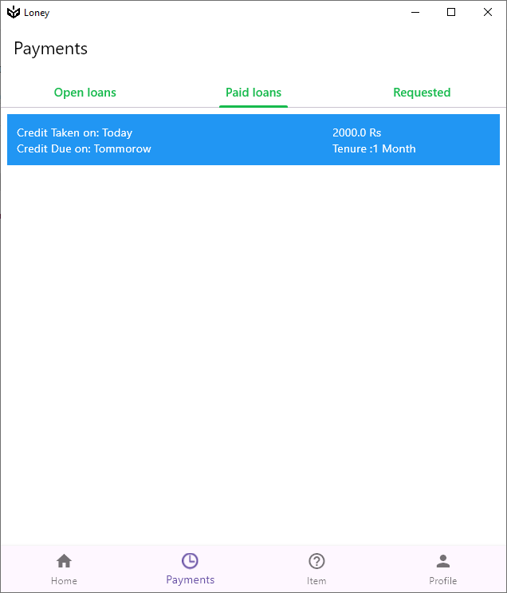
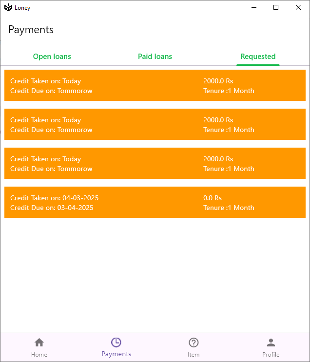
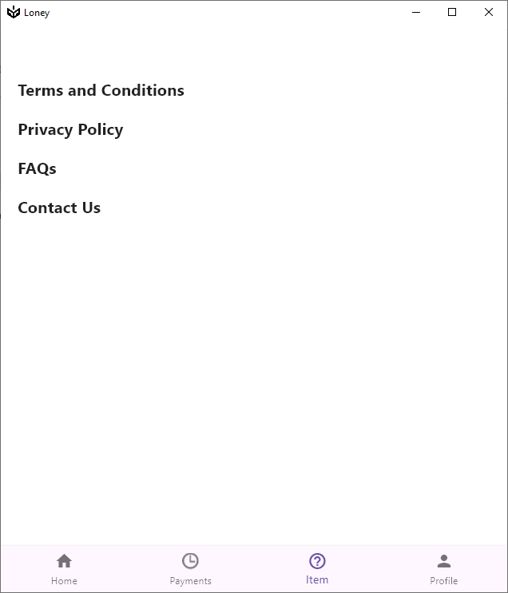
</p>
<p>
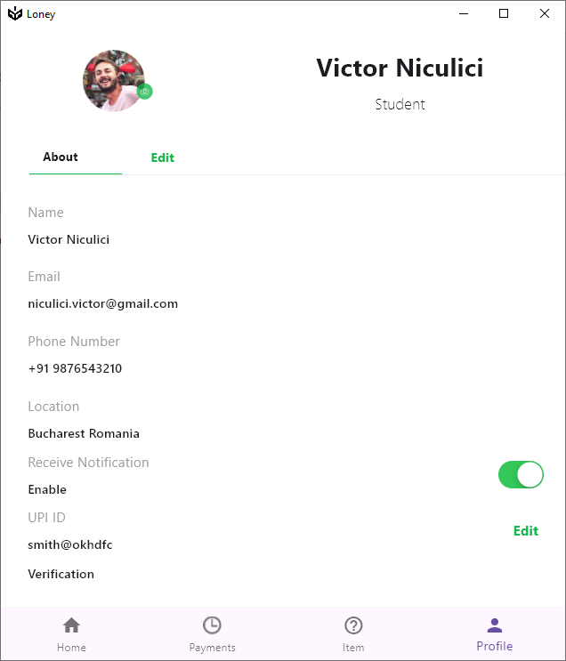
</p>

## Build and Release

This project utilizes GitHub Actions for automated builds and releases. You can find the latest releases here:

* [Link to your latest release on GitHub releases]

### Manual Build Instructions

To build the application manually, follow these steps:

1.  **Prerequisites:**
    * Flutter SDK installed and configured.
    * Android Studio or VS Code with Flutter and Dart plugins installed.
    * For Linux builds, ensure you have the necessary build tools (e.g., `build-essential`).
    * For Windows builds, ensure you have the necessary build tools.

2.  **Clone the Repository:**
    ```bash
    git clone [your-repository-url]
    cd loney
    ```

3.  **Get Dependencies:**
    ```bash
    flutter pub get
    ```

4.  **Run the Application (Development):**
    * **Android:**
        ```bash
        flutter run -d android
        ```
    * **Linux:**
        ```bash
        flutter run -d linux
        ```
    * **Windows:**
        ```bash
        flutter run -d windows
        ```

5.  **Build the Application (Release):**
    * **Android (APK):**
        ```bash
        flutter build apk --split-per-abi
        ```
      The APK will be located in `build/app/outputs/flutter-apk/`.
    * **Linux:**
        ```bash
        flutter build linux
        ```
      The executable will be located in `build/linux/x64/release/bundle/`.
    * **Windows:**
        ```bash
        flutter build windows
        ```
      The executable will be located in `build/windows/x64/release/bundle/`.

## GitHub Actions Setup

This project includes a GitHub Actions workflow (`.github/workflows/flutter_build.yaml`) for automated builds.

## License

MIT License

Copyright (c) 2025 0Vipin0

Permission is hereby granted, free of charge, to any person obtaining a copy
of this software and associated documentation files (the "Software"), to deal
in the Software without restriction, including without limitation the rights
to use, copy, modify, merge, publish, distribute, sublicense, and/or sell
copies of the Software, and to permit persons to whom the Software is
furnished to do so, subject to the following conditions:

The above copyright notice and this permission notice shall be included in all
copies or substantial portions of the Software.

THE SOFTWARE IS PROVIDED "AS IS", WITHOUT WARRANTY OF ANY KIND, EXPRESS OR
IMPLIED, INCLUDING BUT NOT LIMITED TO THE WARRANTIES OF MERCHANTABILITY,
FITNESS FOR A PARTICULAR PURPOSE AND NONINFRINGEMENT. IN NO EVENT SHALL THE
AUTHORS OR COPYRIGHT HOLDERS BE LIABLE FOR ANY CLAIM, DAMAGES OR OTHER
LIABILITY, WHETHER IN AN ACTION OF CONTRACT, TORT OR OTHERWISE, ARISING FROM,
OUT OF OR IN CONNECTION WITH THE SOFTWARE OR THE USE OR OTHER DEALINGS IN THE
SOFTWARE.